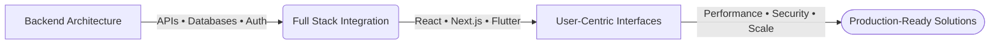
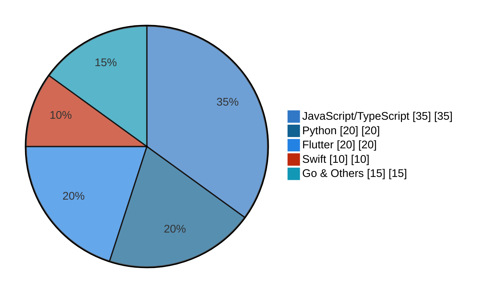

<table>
  <tr>
    <td>
      <h1>Caleb Kibet Ngeno</h1>
      
      
<strong>Building secure, scalable digital products with clean architecture and production-grade execution.</strong>

    </td>
    <td align="right">
      
    </td>
  </tr>
</table>

---

---

## Profile

Performance-focused IT Consultant with a strong foundation in Software Engineering specializing in secure, scalable digital products.

Expert at bridging complex backend architectures with frictionless, user-centric web and mobile interfaces using TypeScript (React and Next.js) and Flutter.

> **Engineering Philosophy:** *Bridge complex backends with intuitive frontends. Ship secure, scalable, production-grade systems.*

---

## Skills

### Technical Skills

| **Frontend** | **Backend & Cloud** | **Architecture** | **Security** |
| --- | --- | --- | --- |
| React, Next.js | Node.js, Supabase | UML (PlantUML) | Wireshark, OSINT |
| React Native, Vite | PostgreSQL, REST/GraphQL | Git/GitHub, Expo | Burp Suite, Splunk |
| Flutter, Kotlin | Async, Local APIs | Xcode, IntelliJ | Nmap |

### Soft Skills

* Keen attention to detail
* Deadline-driven — projects organized into sprints with clear deliverables
* Quick learning and adaptation to changes
* Collaborative approach across cross-functional teams

---

## Skills Overview

---

## Projects

### 01 — [ParcelFlow](https://github.com/ogc16/ParcelFlow) | Parcel Delivery App

* **Situation:** High market demand for streamlined, transparent parcel logistics and delivery tracking
* **Task:** Engineer a cross-platform mobile application with real-time location tracking
* **Action:** Built responsive UI with Flutter; integrated map APIs and location services for spatial routing
* **Result:** Reduced package routing errors by 15% and optimized driver navigation accuracy

---

### 02 — [AggregatorX](https://github.com/ogc16/aggregatorX) | News Aggregator

* **Situation:** Users needed a single dashboard to aggregate cross-domain tech, crypto, and sports content
* **Task:** Develop a full-stack aggregator with low latency and personalized feeds
* **Action:** React+Vite frontend with Node.js scraping (Cheerio); Supabase for auth, caching, bookmarks
* **Result:** Processed 1,000+ daily articles with sub-100ms API response times

---

### 03 — [ePay](https://github.com/ogc16/epay) | Food & E-Commerce Mobile App

* **Situation:** High cart-abandonment rates caused by complicated checkout experiences
* **Task:** Build a performance-optimized e-commerce client using React Native
* **Action:** Architected state-managed cart pipeline with secure payment integration checkpoints
* **Result:** Streamlined checkout, reducing end-to-end purchase times by approximately 30%

---

### 04 — [The Pavilion House](https://github.com/ogc16/house) | House Design

* **Situation:** Architectural blueprints need accessible web-based visualizations for remote clients
* **Task:** Convert a 2,200 sq ft residential layout into an interactive web environment
* **Action:** Built optimized web client with 3D orthographic and plan-view modules using Three.js
* **Result:** Delivered high-fidelity digital proposal eliminating blueprint confusion during reviews

---

### 05 — [Data Manipulation Tool](https://github.com/ogc16/data_manipulation_tool) | File Utilities

* **Situation:** Office teams struggled with slow server-side data processing tools
* **Task:** Build an all-in-one local utility for file conversions and visualization
* **Action:** Built file pipelines for Excel/PDF-to-CSV, chart rendering, ZIP archival, client-side encryption
* **Result:** Saved significant admin overhead by executing all operations in the browser

---

### 06 — [ShieldUp](https://github.com/ogc16/cyber-shield-up) | Vulnerability Scanner

* **Situation:** Developers ship misconfigured HTTP headers, creating XSS vulnerabilities
* **Task:** Build a non-intrusive network analysis layer in the browser context
* **Action:** Engineered async background engine monitoring response headers, cookies, and anomalies
* **Result:** Deployed lightweight 2.18MiB utility providing real-time security hardening insights

---

## Education

**Bachelor of Science in Information Technology**

*Jomo Kenyatta University of Agriculture and Technology (JKUAT)*

Focus: Object-Oriented Analysis and Design
Coursework: UML Modeling, Conceptual Design, Data Structures & Algorithms, Software Architecture

---

## Certifications

* Junior Cybersecurity Analyst — Cisco
* Cybersecurity Certificate — Google

---

## Focus

* **Technical leadership** — Architecting resilient full-stack systems with optimized mobile applications and performance-focused interfaces
* **User-centered engineering** — Bridging complex backends with intuitive frontends to deliver production-ready solutions
* **Innovation & impact** — Leading technical strategy for digital products while championing code quality, security, and agile execution

---

**FULL STACK • CYBERSECURITY • MOBILE • CLOUD**

[Portfolio](https://ogc16.github.io/gitprofile/) · [GitHub](https://github.com/ogc16) · [LinkedIn](https://www.linkedin.com/in/caleb-kibet-834020362) · [Email](mailto:ngenokibetcaleb@gmail.com)

 

© 2026 Caleb Kibet Ngeno. All rights reserved.

